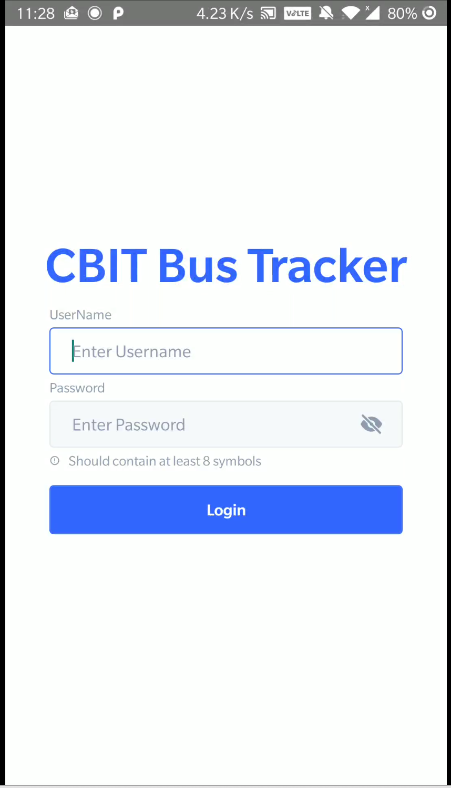
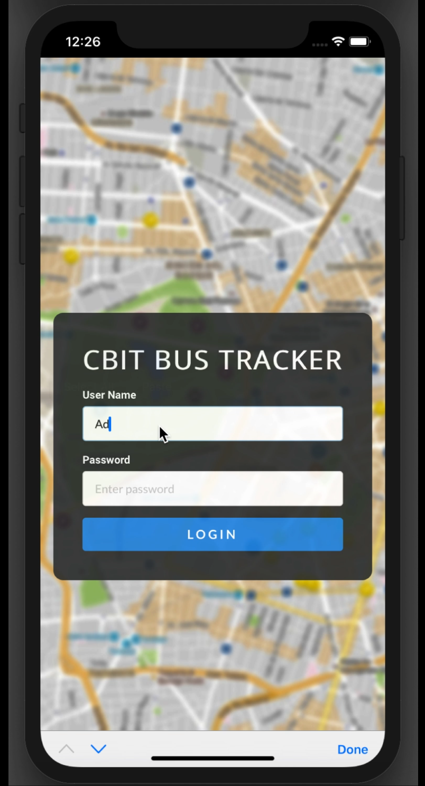
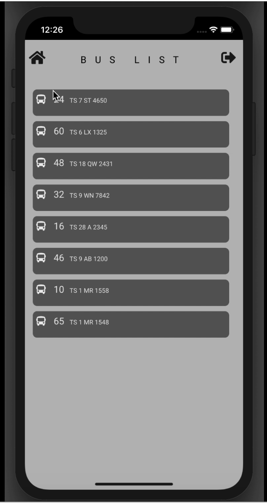
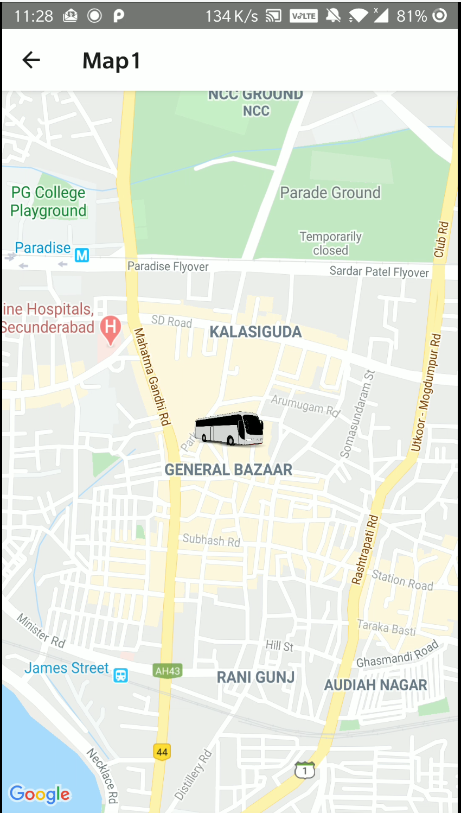
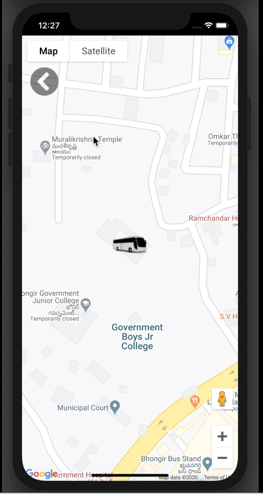

# Internship Project - BusTracker tracks college buses in real time. This application is developed in ReactJS.
## React PWA With Multiple Screens
* Data is fetched from a flask server 
* Implemented JWT handling on the client-side
* Error handling and network requests are logged for later uses.

## Login Screen - Type 1

## Login Screen - Type 2

 
 

## Home Screen - Shows List of Buses

 
 

## Map View - Uses Realtime Coordinates from API to plot the marker in real time.
## React's UseEffect() hook helps in making this possible

